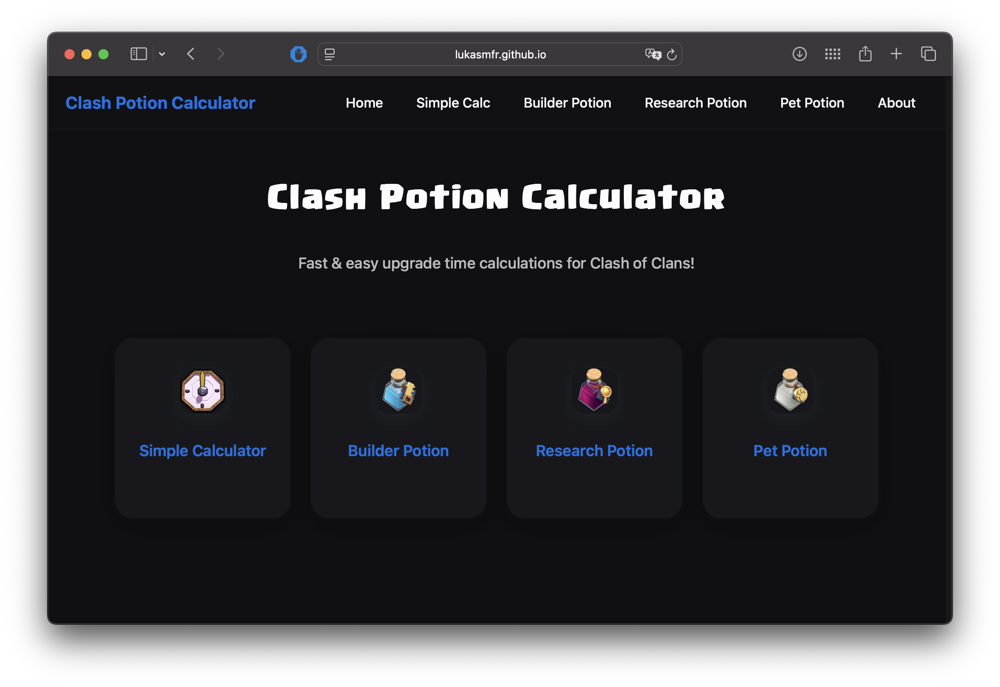

# ⚗️ Clash Potion Calculator

**Clash Potion Calculator** is a modern, responsive web app that helps *Clash of Clans* players quickly calculate upgrade or research completion times when using potions. Whether you're using 🛠️ Builder Potions, 📘 Research Potions, 🐾 Pet Potions, or just want a simple date calculation — this tool has you covered.

> 💡 Built with ❤️ by [Lukas Mauffré](https://github.com/LukasMFR) — fan-made and open source.

---

## 📚 Table of Contents

- [✨ Features](#-features)
- [🖼️ Preview](#️-preview)
- [📁 Project Structure](#-project-structure)
- [🧠 Potions Explained](#-potions-explained)
- [🔧 Technologies Used](#-technologies-used)
- [📦 Installation](#-installation)
- [🌐 Deployment](#-deployment)
- [🤝 Contributing](#-contributing)
- [📄 License](#-license)
- [⚠️ Disclaimer](#️-disclaimer)

---

## ✨ Features

- 🌑 Fully responsive dark/light mode (based on user system preference)
- 🧪 Dedicated calculators for:
  - 🛠️ **Builder Potion** (10x speed for 1 hour)
  - 📘 **Research Potion** (24x speed for 1 hour)
  - 🐾 **Pet Potion** (same as Research)
- ⏱️ Dual input methods: number of potions *or* boost time remaining
- 📆 Friendly end-date display using the system clock
- 💻 Works offline (no server required)

---

## 🖼️ Preview

<p align="center">
  
</p>

---

## 📁 Project Structure

```

clash-potion-calculator/
├── index.html                 # Homepage
├── simple-calc.html          # Simple calculator (no potion logic)
├── builder-potion.html       # Builder Potion calculator
├── research-potion.html      # Research Potion calculator
├── pet-potion.html           # Pet Potion calculator
├── about.html                # About the project
├── css/
│   └── style.css             # Global styles
├── js/
│   ├── calculator.js         # All calculation logic
│   └── utils.js              # Shared utilities (date/time)
├── assets/
│   ├── favicon/              # All favicon files
│   ├── fonts/                # Clash\_Regular.otf
│   └── images/icons          # Potion icons
└── README.md

````

---

## 🧠 Potions Explained

| Potion           | Real-Time Boost | Effective Time Reduced |
|------------------|-----------------|-------------------------|
| 🛠️ Builder Potion | 1h (10x)        | 10h of upgrades         |
| 📘 Research Potion| 1h (24x)        | 24h of lab time         |
| 🐾 Pet Potion     | 1h (24x)        | 24h of pet house time   |

---

## 🔧 Technologies Used

- 🧩 **HTML5** – semantic, accessible layout
- 🎨 **CSS3** – custom properties (variables), responsive layout, blur effects, native dark mode
- ⚙️ **JavaScript** – modular scripts, real-time calculation logic
- 🍎 Inspired UI – styled to feel Apple-like, minimalistic and clean

---

## 📦 Installation

You can clone and run this project locally without any server.

```bash
git clone https://github.com/LukasMFR/clash-potion-calculator.git
cd clash-potion-calculator
open index.html
```

No dependencies or frameworks required.

---

## 🌐 Deployment

You can deploy this on any static hosting platform like:

* GitHub Pages
* Netlify
* Vercel

Example (GitHub Pages):

1. Push to a public GitHub repo
2. Go to **Settings > Pages** and select the root `/` directory
3. Done!

---

## 🤝 Contributing

Contributions are welcome!

Feel free to:

* Suggest features or improvements
* Report bugs
* Open pull requests

---

## 📄 License

This project is licensed under the **MIT License**.
See [`LICENSE`](LICENSE) file for details.

---

## ⚠️ Disclaimer

This project is **not affiliated with, endorsed, sponsored, or specifically approved by Supercell**.
All *Clash of Clans* assets belong to Supercell Oy.
Refer to their [Fan Content Policy](https://supercell.com/en/fan-content-policy/) for more information.
